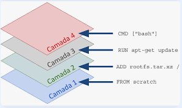

### O que é um container

Um container é isolamento, ou seja, ele isola recursos computacionais, como memória RAM e CPU. Além do isolamento de recursos físicos
o container também faz o isolamento de recursos do sistema operacional, como grupo de usuários, rede, etc.

O container executa um sistema operacional extremamente enchuto, um SO que é criado para executar apenas a funcionalidade que foi criado. Por exemplo,
quando criamos um container com a imagem de um python, esse container não vai possuir o postgres instalado por exemplo. 

Mas o que seria as imagens? As imagens são camadas de softwares que quando são unidas, formam um container. Por exemplo, imagine que pegamos um ubuntu, este ubuntu não possui quase nada instalado. O próprio ubuntu é uma camada, ou seja, toda a construção daquele SO se torna uma camada. Quando fazemos um ``` apt-get install curl ```, criamos uma nova camada para esta imagem. A imagem abaixo exemplifica bem esta explicação.



Um container roda a partir do kernel do SO host, visto que realizamos apenas o isolamento de recursos do próprio host. Portanto, a função do kernel, é realizar o isolamento de recursos para cada determinado container.


