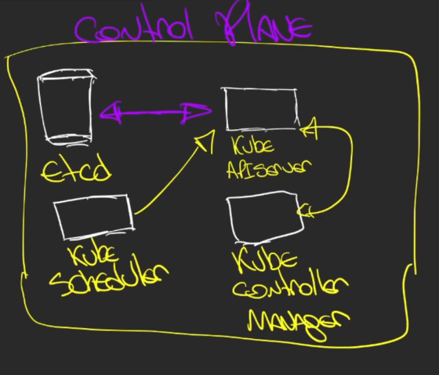
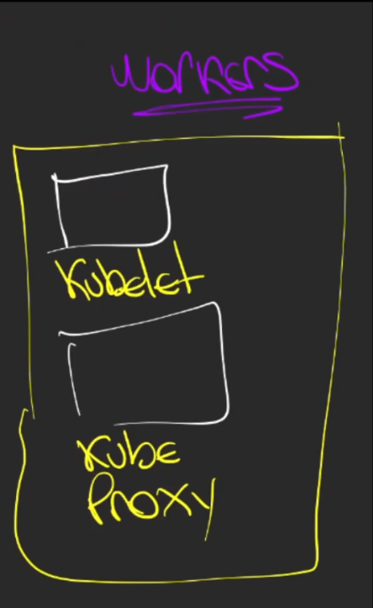
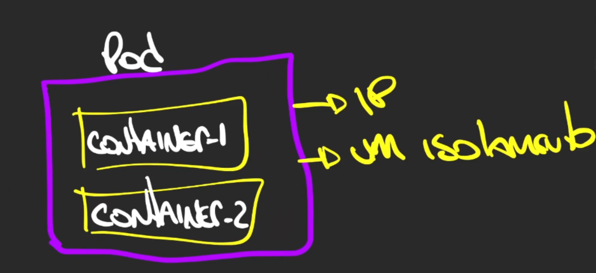

## Kubernetes

## arquitetura

### Control plane
É responsável por garantir a saúde do cluster, disponibilidade, capacidade e estado.

Componentes:
- ETCD - Banco do cluster, guarda estado do cluster. *informações coletadas do KubeAPIServer*
- KubeApiServer - Coleta status de todo o cluster, validando necessidade de réplicas, etc.
- KubeScheduler - Responsável pelo gerenciamento da criação de novos containers.
- KubeControllerManager - Controlador do cluster.

### Workers
São os nodes onde estão rodando as aplicações. Todos os container da aplicação está rodando no node de workers.

Componentes:
- Kubelet - Agente do kubernetes dentro do nó. Se comunica com o KubeApiServer informando estado dos containers.
- KubeProxy - Realiza a comunicação dos containers, agindo como um proxy.

Cada componente possui a sua porta de comunicação, sendo ela TCP ou UDP. São elas:

| Componente      | Porta         | Protocolo |
|-----------------|---------------|-----------|
| Kube-ApiServer  | 6443          | TCP       |
| ETCD            | 2379 - 2380   | TCP       |
| Kube-Controller | 10252         | TCP       |
| Kube-Scheduller | 10251         | TCP       |
| Kubelet         | 10250         | TCP       |
| Node-port       | 30000 - 32767 | TCP       |
| Weave-net       | 6783/6784     | TCP/UDP   |          

# Objetos e recursos

### Pods
É a menor unidade do kubernetes. Pode possuir um ou mais containers.
Independente da quantidade de containers, o pod possui apeanas um IP e pode ser visto como um isolamento. 

### Deployments
É responsável por controlar os pods. Controlando réplicas, imagem, recursos.

### Réplica sets
Responsável por garantir a quantidade de réplicas em um deployment. 

### Service
Responsável por realizar a comunicação dos pods com o ambiente fora do nó ou cluster.